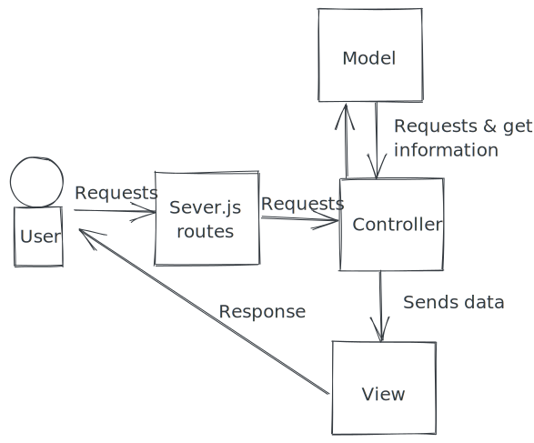

# Composer

## Description
The idea is that it will take a route and use that name to assimilate the related MVC files & load the view.

## Pre-requisites
Git & Node

## Foundation
- create react app
- express
- ejs

## Getting Started
1. `npm install`
2. `npm run start`